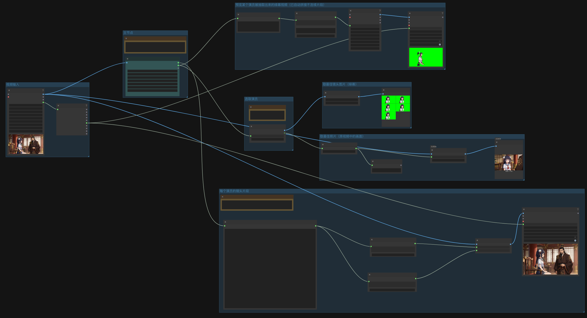

# ComfyUI-VideoActorExtract

从视频中自动检测、追踪、识别所有出场人物，输出每个人物的绿幕抠图视频和出镜元数据。

**核心能力：**
- 逐帧人物分割（YOLOv8-seg）
- 质心距离多目标追踪（MaskTracker）
- 基于人脸识别的身份聚类（InsightFace），支持跨时段合并 + 共现互斥
- 多种抠像背景可选（绿、蓝、黑、白），默认绿色
- 多段出场自动合并为单个视频
- JSON 结构化元数据（帧范围、时间戳）

---

## 功能说明

### 它能做什么

1. **人物检测与分割** — 使用 YOLOv8-seg 逐帧检测画面中所有人物，生成像素级分割掩码
2. **多目标追踪** — 通过质心距离匹配，将同一人物的连续帧关联为 track
3. **身份聚类** — 使用 InsightFace 提取人脸特征，将同一人不同时间段的 track 合并为同一个 actor
   - **共现互斥约束**：同一帧出现的两个人物绝不会合并为同一人
   - **跨时段合并**：人物消失后重新出现，自动合并到同一 actor
4. **抠像输出** — 将人物轮廓外的区域替换为自定义纯色背景（绿/蓝/黑/白）
5. **视频编码** — 同一 actor 的所有出场段合并为一个 MP4 文件
6. **元数据输出** — 生成 JSON 文件，记录每个 actor 的出镜时间段

### 典型使用场景

- 影视剪辑：快速提取每个角色的所有镜头
- 视频分析：统计每个人物的出场时长
- 内容创作：透明/绿幕抠图用于二次创作
- 人脸分析：按人物分组后进一步分析表情/动作

---

## 架构说明

### 处理管线

```
┌─────────────────────────────────────────────────────────────────────┐
│                        VideoActorExtractor Node                      │
├─────────────────────────────────────────────────────────────────────┤
│                                                                      │
│  IMAGE batch (VHS LoadVideo)                                         │
│       │                                                              │
│       ▼                                                              │
│  ┌──────────────┐                                                    │
│  │ PersonSegmenter │ YOLOv8-seg, 逐帧人物分割                         │
│  │  (每帧检测)     │ 输出: [(detection_idx, bool_mask), ...]          │
│  └──────┬───────┘                                                    │
│         │                                                            │
│         ▼                                                            │
│  ┌──────────────┐                                                    │
│  │  MaskTracker   │ 质心距离追踪, 帧间关联                              │
│  │  (帧间追踪)     │ 输出: {actor_id: [(frame_idx, bool_mask, area)]}    │
│  └──────┬───────┘                                                    │
│         │                                                            │
│         ▼                                                            │
│  ┌──────────────┐                                                    │
│  │ IdentityCluster│ InsightFace 人脸特征 + 贪心聚类                    │
│  │  (身份合并)     │ 约束: 共现互斥 + 跨时段合并                        │
│  └──────┬───────┘                                                    │
│         │                                                            │
│         ▼                                                            │
│  ┌──────────────┐                                                    │
│  │ SegmentBuilder │ 连续段构建, 小间隙插值                              │
│  │  (段构建)       │ 输出: {actor_id: [segment_frames, ...]}            │
│  └──────┬───────┘                                                    │
│         │                                                            │
│         ▼                                                            │
│  ┌──────────────┐                                                    │
│  │    Merger      │ cv2.VideoWriter 编码 + JSON 生成                   │
│  │  (视频输出)     │ 输出: actor_X.mp4 + actor_info.json               │
│  └──────────────┘                                                    │
│                                                                      │
└─────────────────────────────────────────────────────────────────────┘
```

### 模块说明

| 模块 | 文件 | 功能 |
|------|------|------|
| **PersonSegmenter** | `pipeline/segmenter.py` | YOLOv8-seg 人物分割，输出像素级掩码 |
| **MaskTracker** | `pipeline/mask_tracker.py` | 质心距离追踪，将同一人的连续帧关联为 track |
| **IdentityCluster** | `pipeline/identity.py` | InsightFace 人脸识别 + 贪心聚类，合并同一个人 |
| **SegmentBuilder** | `nodes/actor_extractor.py` | 连续段构建，小间隙帧插值 |
| **Merger** | `pipeline/merger.py` | 视频编码 + JSON 元数据生成 |
| **VideoActorExtractor** | `nodes/actor_extractor.py` | ComfyUI 主节点，编排整个管线 |

### 身份聚类算法

```
输入: {track_id: [FrameRecord, ...]}
输出: {track_id: "actor_0", ...}

算法:
1. 对每个 track 采样最多 30 帧（优先面积最大的帧）
2. 每帧尝试多种 crop 尺寸 (0.6x, 1.0x, 1.5x, 2.0x) 检测人脸
3. 计算 track 间人脸 embedding 余弦相似度
4. 贪心聚类:
   - 遍历每个 track，找最佳匹配的现有 actor
   - 共现检查: 如果 track 与 actor 中任何成员在同一帧出现 → 禁止合并
   - 相似度 ≥ threshold → 合并
   - 否则 → 创建新 actor
5. 无脸 track → 时空重叠 fallback 合并
6. 重新编号为 actor_0, actor_1, ...
```

**关键约束：共现互斥**

同一帧出现的两个人物，即使人脸相似度很高，也绝不会合并为同一人。这解决了双胞胎、长相相似的人被错误合并的问题。

---

## 项目结构

```
ComfyUI-VideoActorExtract/
├── __init__.py                    # ComfyUI 入口 (importlib 动态加载)
├── requirements.txt               # Python 依赖
├── pyproject.toml                 # 项目元数据
├── nodes/
│   ├── actor_extractor.py         # 主节点 + 连续段构建
│   └── select_preview.py          # SelectActorPreview 节点
├── pipeline/
│   ├── segmenter.py               # YOLOv8-seg 人物分割
│   ├── mask_tracker.py            # 质心距离追踪
│   ├── identity.py                # InsightFace 身份聚类
│   ├── detector.py                # YOLOv8 人物检测 (bbox)
│   ├── tracker.py                 # ByteTrack 追踪 (可选)
│   ├── cropper.py                 # 绿幕抠图 (历史遗留)
│   └── merger.py                  # 视频编码 + JSON 输出
├── core/
│   ├── config.py                  # 全局配置常量
│   └── video_reader.py            # 视频读取
├── docs/
│   ├── requirements.md            # 需求文档
│   └── architecture.md            # 架构设计
├── examples/
│   └── README.md                  # 工作流示例说明
└── js/
    └── widget.js                  # 前端组件
```

---

## 安装

### 1. 安装插件

**方式一：ComfyUI Manager（推荐）**

ComfyUI → Manager → Install Custom Node → 搜索 `ComfyUI-VideoActorExtract` → 点击安装

**方式二：手动安装**

```bash
cd ComfyUI/custom_nodes/
git clone https://github.com/YunyangGong/ComfyUI-VideoActorExtract.git
```

### 2. 安装依赖

```bash
cd ComfyUI/custom_nodes/ComfyUI-VideoActorExtract
pip install -r requirements.txt
```

**关键依赖：**
- `ultralytics` — YOLOv8 检测 / 分割
- `opencv-python` — 图像处理 + 视频编码
- `insightface` — 人脸识别
- `onnxruntime` — InsightFace 推理引擎
- `numpy` — 数值计算

> **注意**：Apple Silicon (M1/M2/M3) Mac 会自动使用 `onnxruntime-silicon`，无需手动切换。

### 3. 下载模型

> **模型会自动下载**：首次运行时，插件会自动检测并下载缺失的模型文件（YOLOv8 和 InsightFace buffalo_l）。如果自动下载失败，可以手动按以下步骤操作。

所有模型文件需要放到 `ComfyUI/models/video-actor-extract/` 目录下。

#### 3.1 YOLOv8 检测模型 + 分割模型

```bash
cd ComfyUI/models/video-actor-extract/

# 下载 yolov8n.pt（人物检测）
curl -L -o yolov8n.pt \
  "https://github.com/ultralytics/assets/releases/download/v8.3.0/yolov8n.pt"

# 下载 yolov8n-seg.pt（人物分割）
curl -L -o yolov8n-seg.pt \
  "https://github.com/ultralytics/assets/releases/download/v8.3.0/yolov8n-seg.pt"
```

#### 3.2 InsightFace 人脸识别模型

buffalo_l 模型包（~350MB），需要放到 `ComfyUI/models/video-actor-extract/buffalo_l/`。

使用 InsightFace Python API 一键下载：

```python
from insightface.app import FaceAnalysis
FaceAnalysis(name='buffalo_l', root='ComfyUI/models/video-actor-extract').prepare(ctx_id=-1, det_size=(640, 640))
```

> **注意**：InsightFace 默认会把模型下载到 `ComfyUI/models/video-actor-extract/models/buffalo_l/`，需要手动移动到正确位置：

```bash
# 将模型从 models/ 子目录移到上一级
mv ComfyUI/models/video-actor-extract/models/buffalo_l/ ComfyUI/models/video-actor-extract/buffalo_l/
# 清理空目录
rm -rf ComfyUI/models/video-actor-extract/models/
```

#### 最终模型目录结构

```
ComfyUI/models/video-actor-extract/
├── yolov8n.pt
├── yolov8n-seg.pt
└── buffalo_l/
    ├── 1k3d68.onnx
    ├── 2d106det.onnx
    ├── det_10g.onnx
    ├── genderage.onnx
    └── w600k_r50.onnx
```

> **提示**：如果 ComfyUI 是通过 pip 安装的，`ComfyUI/models/` 通常在 ComfyUI 仓库根目录下。如果你使用了自定义的 `--output` 或 `--models` 路径参数，请将模型放到对应的 models 目录中。

---

## 使用方法



> 工作流文件：[`examples/video-actor-extract.json`](examples/video-actor-extract.json)（拖入 ComfyUI 画布即可使用）

### 节点说明

本插件提供两个 ComfyUI 节点：

---

#### VideoActorExtractor

从视频中自动检测、追踪、识别所有出场人物，输出每个角色的绿幕抠图视频和结构化元数据。

**输入**

| 参数 | 类型 | 必填 | 默认值 | 说明 |
|------|------|------|--------|------|
| `images` | IMAGE | ✅ | — | 视频帧 batch。从 VHS LoadVideo / LoadVideoPath 等节点连接 |
| `model_path` | STRING | — | `yolov8n.pt` | YOLOv8 人物检测模型文件名 |
| `seg_model_path` | STRING | — | `yolov8n-seg.pt` | YOLOv8-seg 人物分割模型文件名 |
| `video_path` | STRING | — | `""` | 原始视频文件路径。填入后用于精确计算元数据（时长、帧率等） |
| `max_actors` | INT | — | `10` | 最大检测人数 (1-50) |
| `face_threshold` | FLOAT | — | `0.6` | 人脸相似度聚类阈值 (0.1-0.99)。越高越严格，越不容易误合并 |
| `min_track_length` | INT | — | `5` | 最小追踪帧数 (1-100)。低于此值的 track 会被过滤掉 |
| `skip_every_n` | INT | — | `1` | 每隔 N 帧处理一次 (1-30)。1=全部帧，2=每隔一帧，越大越快但精度越低 |
| `bg_color` | COMBO | — | `green` | 抠像背景色：`green`(绿，默认) / `blue`(蓝) / `black`(黑) / `white`(白) |

**输出**

| 输出 | 类型 | 说明 |
|------|------|------|
| `actor_info_json` | STRING | JSON 字符串，包含所有 actor 的出镜段信息（帧范围、时间戳） |
| `output_dir` | STRING | 输出目录路径，包含 MP4 视频、预览图和元数据文件 |
| `actor_count` | INT | 检测到的 actor 总数 |

**输出目录结构**

```
{output_dir}/
├── actor_0.mp4 (or .webm)   # 第一个人物的抠像视频
├── actor_1.mp4              # 第二个人物的抠像视频
├── ...
├── actor_info.json          # 结构化元数据（所有 actor）
└── previews/
    ├── actor_0_0.png       # actor_0 的第 1 张预览（按人脸面积降序，带 alpha 通道）
    ├── actor_0_1.png       # actor_0 的第 2 张预览
    ├── actor_0_2.png
    ├── actor_0_3.png
    ├── actor_0_4.png       # actor_0 的第 5 张预览
    ├── actor_0_indexes.json # actor_0 预览帧在原视频中的帧索引 [22, 32, 72, 23, 24]
    ├── actor_1_0.png
    ├── ...
    └── actor_1_indexes.json
```

**典型连接方式**

```
VHS_LoadVideoPath → VideoActorExtractor → (隐式保存文件到磁盘)
```

> VideoActorExtractor 不是 output node，不会自动在 ComfyUI 中显示预览。它的输出（JSON、目录路径、actor 数量）可以连接到其他节点做进一步处理。

---

#### SelectActorPreview

加载指定 actor 的预览图片，作为 IMAGE batch 输出，同时返回这些预览帧在原视频中的帧索引。

**输入**

| 参数 | 类型 | 必填 | 默认值 | 说明 |
|------|------|------|--------|------|
| `output_dir` | STRING | ✅ | — | VideoActorExtractor 的 `output_dir` 输出 |
| `actor_index` | INT | ✅ | `0` | 要预览的 actor 编号 (0-based)。0 = 第一个人物，1 = 第二个，以此类推 |

**输出**

| 输出 | 类型 | 说明 |
|------|------|------|
| `images` | IMAGE | 预览图 batch `[N, H, W, 3]` (RGB, float32, 0-1)。N 通常为 5，但如果该 actor 出镜帧不足 5 帧则更少 |
| `indexes` | INT[] | 预览帧在原视频中的帧索引列表。例如 `[22, 32, 72, 23, 24]` 表示第 1 张预览图来自原视频第 22 帧 |

> 预览图按 InsightFace 检测到的人脸面积降序排列，选取人脸最大的 5 帧。仅包含成功检测到人脸的帧。

**典型连接方式**

```
VideoActorExtractor → SelectActorPreview → PreviewImage (查看预览图)
                                        → 任意节点 (使用 indexes 帧索引)
```

---

### 完整工作流示例

```
┌───────────────────────┐
│   VHS_LoadVideoPath    │  加载视频文件
│   video: your_video.mp4│
└───────────┬───────────┘
            │ IMAGE batch
            ▼
┌───────────────────────┐
│  VideoActorExtractor   │  检测 → 追踪 → 聚类 → 绿幕视频
│  max_actors: 5        │
│  face_threshold: 0.6   │
└──┬──────┬──────┬──────┘
   │      │      │
   │STRING │STRING │INT
   ▼      ▼      ▼
 (json) (dir)  (count)

            │ STRING (output_dir)
            ▼
┌───────────────────────┐
│  SelectActorPreview   │  加载 actor_0 的预览图
│  actor_index: 0       │
└──┬──────────────┬────┘
   │IMAGE         │INT[]
   ▼              ▼
┌──────────┐  (帧索引列表)
│PreviewImage│  [22, 32, 72, 23, 24]
└──────────┘
```

### 参数详解

#### face_threshold — 人脸相似度阈值

决定两个人"长得像"到什么程度才算同一个人。系统会对每个检测到的人提取人脸特征向量，计算两两之间的相似度（0~1，1=完全一样），只有相似度 ≥ 这个阈值才会合并为同一个 actor。

| 值 | 含义 | 适用场景 |
|----|------|---------|
| 0.5 | 宽松，容易把不同的人误合并 | 同一人变化不大、人数少 |
| **0.6** | **默认，平衡准确性和召回率** | **大多数视频** |
| 0.75 | 严格，角度/光线变化大时可能拆分同一人 | 精确区分角色、双胞胎 |

#### min_track_length — 最小追踪帧数

一个人至少要连续出现多少帧才算"有效人物"。低于此值的 track 会被直接丢弃，用于过滤短暂的误检（影子、路人一闪而过等）。

| 值 | 含义（30fps 下） | 适用场景 |
|----|-------------------|---------|
| 3 | 保留 0.1 秒以上的人物 | 短视频、不想漏人 |
| **5** | **保留 0.17 秒以上的人物（默认）** | **大多数视频** |
| 10 | 保留 0.33 秒以上的人物 | 背景干扰多、人流密集 |
| 20+ | 只保留长时间稳定出镜的人物 | 精确统计主要角色 |

### 参数调优建议

| 场景 | 建议参数 |
|------|---------|
| 单人视频 | `min_track_length=3` |
| 多人对话 | `face_threshold=0.65, min_track_length=5` |
| 过滤短暂误检 | `min_track_length=10` |
| 区分双胞胎/相似脸 | `face_threshold=0.75` |
| 合并远距离同一个人 | `face_threshold=0.5` |

---

## 输出

### 文件结构

每次运行在 `ComfyUI/output/ComfyUI-VideoActorExtract/{uuid}/` 下生成：

```
{uuid}/
├── actor_0.mp4              # 第一个人物的抠像视频
├── actor_1.mp4              # 第二个人物的抠像视频
├── ...
├── actor_info.json          # 结构化元数据（所有 actor）
└── previews/
    ├── actor_0_0.jpg       # actor_0 预览图（按人脸面积降序取前 5）
    ├── actor_0_1.jpg
    ├── actor_0_2.jpg
    ├── actor_0_3.jpg
    ├── actor_0_4.jpg
    ├── actor_0_indexes.json # 预览帧在原视频中的帧索引
    ├── actor_1_0.jpg
    ├── ...
    └── actor_1_indexes.json
```

### JSON 格式

```json
{
  "actors": [
    {
      "actor_id": "actor_0",
      "segment_count": 2,
      "total_frames": 156,
      "segments": [
        {
          "segment_id": 0,
          "start_frame": 24,
          "end_frame": 89,
          "start_time_sec": 0.8,
          "end_time_sec": 2.97,
          "frame_count": 66
        },
        {
          "segment_id": 1,
          "start_frame": 200,
          "end_frame": 260,
          "start_time_sec": 6.67,
          "end_time_sec": 8.67,
          "frame_count": 61
        }
      ]
    }
  ],
  "video_info": {
    "total_frames": 300,
    "fps": 30,
    "width": 1920,
    "height": 1080,
    "duration_sec": 10.0
  }
}
```

---

## 测试

### API 测试（完整工作流）

```python
import json, urllib.request, time

wf = {
    'prompt': {
        '7': {
            'class_type': 'VHS_LoadVideoPath',
            'inputs': {
                'video': 'your_video.mp4',
                'force_rate': 0,
                'custom_width': 0,
                'custom_height': 0,
                'frame_load_cap': 0,
                'skip_first_frames': 0,
                'select_every_nth': 1
            }
        },
        '33': {
            'class_type': 'VideoActorExtractor',
            'inputs': {
                'images': ['7', 0],
                'video_path': 'your_video.mp4',
                'max_actors': 5,
                'face_threshold': 0.6,
                'min_track_length': 5,
                'skip_every_n': 1,
                'bg_color': 'green',
            }
        },
        '36': {
            'class_type': 'DF_To_text_(Debug)',
            'inputs': {'ANY': ['33', 1]}
        },
        '34': {
            'class_type': 'SelectActorPreview',
            'inputs': {
                'output_dir': ['33', 1],
                'actor_index': 0
            }
        },
        '35': {
            'class_type': 'PreviewImage',
            'inputs': {'images': ['34', 0]}
        }
    }
}

data = json.dumps(wf).encode()
req = urllib.request.Request(
    'http://127.0.0.1:8188/prompt',
    data=data,
    headers={'Content-Type': 'application/json'}
)
r = urllib.request.urlopen(req, timeout=30).read()
pid = json.loads(r)['prompt_id']
print(f'Queued: {pid}')

for i in range(600):
    time.sleep(2)
    h = json.loads(urllib.request.urlopen(
        f'http://127.0.0.1:8188/history/{pid}', timeout=10
    ).read())
    if pid in h:
        s = h[pid].get('status', {})
        if s.get('status_str') == 'error':
            print('ERROR:', h[pid].get('messages', [])[-3:])
            break
        if h[pid].get('outputs'):
            print(f'Done! ({i*2}s)')
            for n, o in h[pid]['outputs'].items():
                print(f'  Node {n}: {list(o.keys())}')
            break
    if i % 15 == 0:
        print('.', end='', flush=True)
```

### 验证输出

```bash
# 查看最新输出
ls -lt ~/App/ComfyUI/output/ComfyUI-VideoActorExtract/ | head -5

# 检查 JSON 元数据
cat ~/App/ComfyUI/output/ComfyUI-VideoActorExtract/{uuid}/actor_info.json | python -m json.tool

# 检查视频文件
ffprobe ~/App/ComfyUI/output/ComfyUI-VideoActorExtract/{uuid}/actor_0.mp4
```

### 调试日志

ComfyUI 控制台会输出详细日志：

```
[VideoActorExtract] Step 1: Initializing person segmenter...
[PersonSegmenter] Loaded yolov8n-seg.pt on mps
[VideoActorExtract] Step 3: Detecting masks and tracking actors...
  Processed 50/290 frames (4.4s, 11.3 fps)
[MaskTracker] Closed actor_0: no match for 31 frames
[VideoActorExtract] Step 4: Tracking complete. 4 mask actors, 391 total detections
[VideoActorExtract] Step 5: Clustering actor identities...
[Identity] Face detection: 4/4 tracks have face embeddings
[Identity]   Track 0: 26 faces detected
[Identity] Building similarity matrix (4x4)...
[Identity] Merged track 3(197-288) -> actor_1 (sim=0.734)
[Identity] Final: 2 unique actors
```

---

## 限制

| 限制 | 说明 |
|------|------|
| 最小人物尺寸 | ~20px，过小人物可能漏检 |
| 人脸识别 | 依赖面部可见，全程无正面的人物会被分配独立 ID |
| 建议视频时长 | ≤ 5 分钟 |
| 建议同时人数 | ≤ 5 人 |
| 内存占用 | 帧逐帧处理，但大视频仍需足够 RAM；可用 skip_every_n 降低内存压力 |

---

## 许可证

MIT
